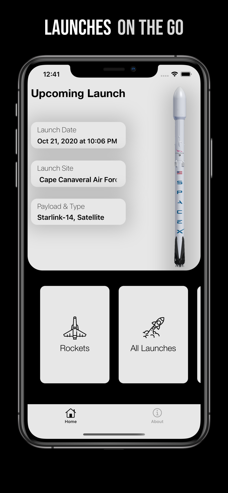
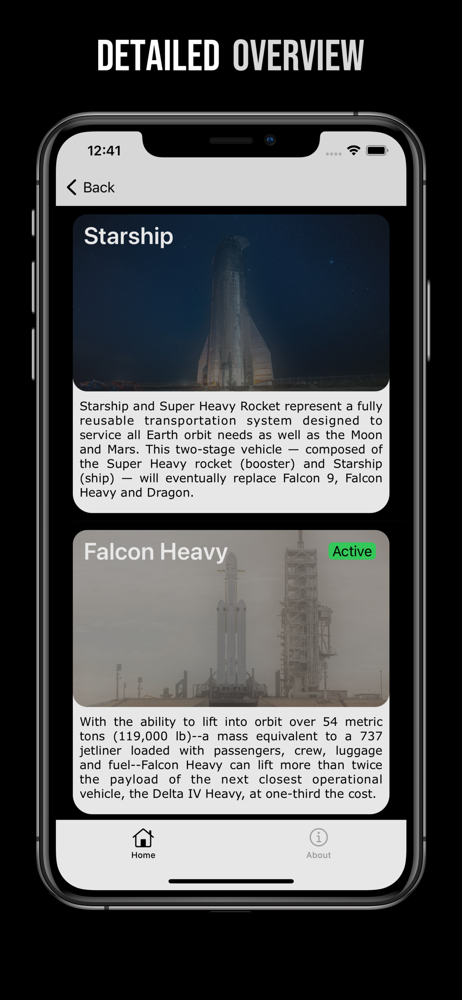
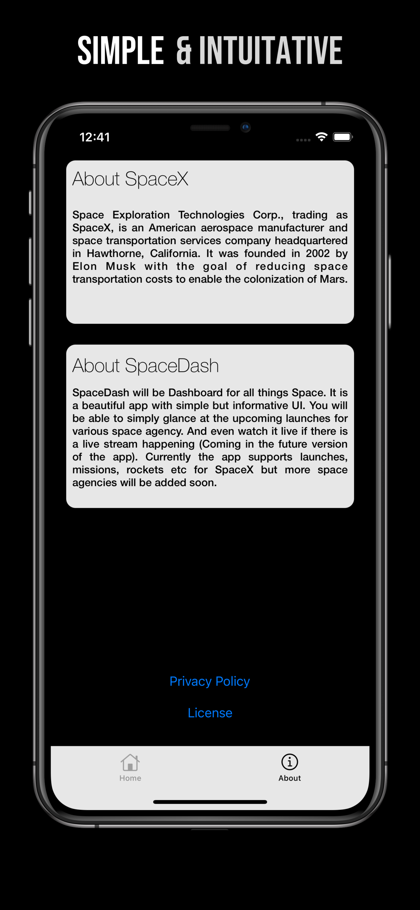

   <!-- ALL-CONTRIBUTORS-BADGE:START - Do not remove or modify this section -->

<!-- ALL-CONTRIBUTORS-BADGE:END -->

# SpaceDash

### A Dashboard for Space...🚀🚀🚀 

SpaceDash is an open-source app that provides information on all the present, past, and future **launches and vehicles of SpaceX**. The SpaceDash app also includes news and updates regarding all vehicles and missions.

The app is currently in the second stage of development and several new features are being scoped/built. These features include an AR view of various vehicles of SpaceX and event updates from even more Space Agencies!

The project uses test-drive agile development processes, where requirements are turned into test cases, and code is improved upon. 

***Notice***

Currently, new version was not accepted by the App Store review team. Since there was recent update to the r/SpaceX API which caused our app to crash on launch and no way to update our App I removed it from the App Store as of now. The team is working to add functionality to the app which will become Version 2 of the app. Version 2 of the will be available in early to mid January. To still use and test the app, you can use the beta version using Testflight link above.

## 📸 Screenshots

   &nbsp
   &nbsp
  

## 👾 Technologies
> To help scale development, this app is built using the MVC design pattern. subsequent changes made by contributors do not affect the central architecture.
* UIKit
* XCTests
* Lottie

## ⚙️  Getting Started

### Resources
* [Architecure.md](https://github.com/pushpinderpalsingh/SpaceDash/blob/develop/Architecture.md)
* [Contributing.md](https://github.com/pushpinderpalsingh/SpaceDash/blob/develop/Contributing.md)
* [SpaceX API](https://github.com/r-spacex/SpaceX-API)

###  Requirements

-   iOS 13.0+
-   Xcode 11.0+
-   macOS Catalina or above

###  Setup

1) Fork this project
2) Clone the forked project to your machine
3) In your project directory open Terminal and Run  `$ pod install`  and  `$ pod update`
4) Open the `.xcworkspace` file in Xcode to start menu working on the App

###  Contribute with us!

Before you start developing please read through [Contributing.md](https://github.com/pushpinderpalsingh/SpaceDash/blob/develop/Contributing.md) 

#### Set up contributing environment

Before you assist with the development, please set up the project on your local machine, run it, and go through the complete application 

Click through buttons you can find and see where they take you. Explore the app in detail so that you are aware of core features.

#### [Join the conversation on Slack. :speech_balloon: ](https://communityinviter.com/apps/spacedashworkspace/spacedash)

## License

This project is licensed under the MIT License - see [LICENSE.md](https://github.com/pushpinderpalsingh/SpaceDash/blob/develop/LICENSE.md) for details

## Acknowledgement
- [RocketLaunch.Live](https://www.rocketlaunch.live/)
- [r/SpaceX API](https://github.com/r-spacex/SpaceX-API)

#### This project won't be possible without our contributors. You may see [Contributors.md](https://github.com/pushpinderpalsingh/SpaceDash/blob/develop/Contributors.md) for details.

